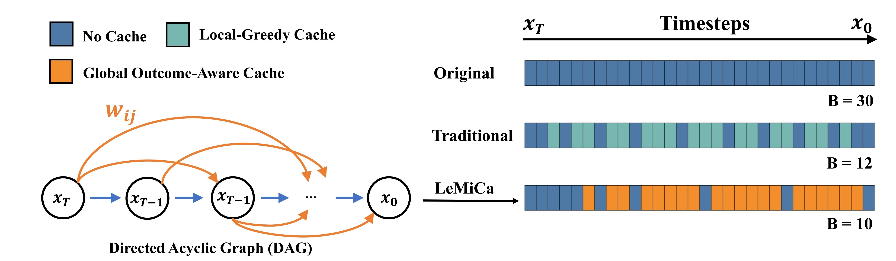
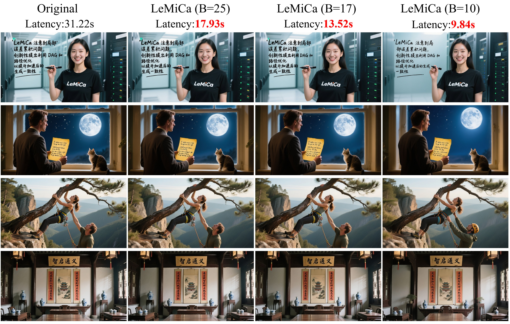

<span>📚English  |   <a href="./README_CN.md">📚中文阅读 </a> &nbsp;  | &nbsp; <a href="https://mp.weixin.qq.com/s/o6MMOzbmGBRpB_a_9U8JMw?">机器之心</a> 
</span>


<div align="center">

</div>


# [NeurIPS 2025 Spotlight] LeMiCa: Lexicographic Minimax Path Caching for Efficient Diffusion-Based Video Generation

<div class="is-size-5 publication-authors" align="center">
  <span class="author-block">
    <a href="https://github.com/joelulu" target="_blank">Huanlin Gao</a><sup>1,2</sup><sup>*</sup>,&nbsp;
  </span>
  <span class="author-block">
    <a href="https://scholar.google.com/citations?hl=zh-CN&view_op=list_works&user=gpNOW2UAAAAJ" target="_blank">Ping Chen</a><sup>1,2</sup><sup>*</sup>,&nbsp;
  </span>
  <span class="author-block">
    <a href="https://github.com/stone002" target="_blank">Fuyuan Shi</a><sup>1,2</sup>,&nbsp;
  </span>
  <span class="author-block">
    <a href="https://github.com/tanchaow" target="_blank">Chao Tan</a><sup>1,2</sup>,&nbsp;
  </span>
  <span class="author-block">
    <a href="https://scholar.google.com/citations?hl=en&user=L4OXOs0AAAAJ" target="_blank">Zhaoxiang Liu</a><sup>1,2</sup>
  </span>
  <br>
  <span class="author-block">
    <a href="https://github.com/FangGet" target="_blank">Fang Zhao</a><sup>1,2</sup><sup>†</sup>,&nbsp;
  </span>
  <span class="author-block">
    <a href="https://scholar.google.com/citations?user=CFUQLCAAAAAJ&hl=en" target="_blank">Kai Wang</a><sup>1,2</sup>,&nbsp;
  </span>
  <span class="author-block">
    <a href="https://scholar.google.com.hk/citations?user=kCC2oKwAAAAJ&hl=zh-CN&oi=ao" target="_blank">Shiguo Lian</a><sup>1,2</sup><sup>†</sup>
  </span>
</div>

<div class="is-size-5 publication-authors" align="center">
  <span class="author-block"><sup>1</sup>Data Science & Artificial Intelligence Research Institute, China Unicom,&nbsp;</span>
  <span class="author-block"><sup>2</sup>Unicom Data Intelligence, China Unicom</span>
</div>

<div class="is-size-5 publication-authors" align="center">
  (* Equal contribution. † Corresponding author.)
</div>

<h5 align="center">

<a href="https://unicomai.github.io/LeMiCa/" target="_blank">
  
</a>
<!-- <a href="https://github.com/UnicomAI/LeMiCa" target="_blank">
  
</a> -->
<a href="https://arxiv.org/abs/2511.00090" target="_blank">
  
</a>
<!-- <a href="https://github.com/UnicomAI/LeMiCa/raw/main/assets/LeMiCa_NeurIPS2025_appendix.pdf" target="_blank">
  
</a> -->
</a>
<a href="./LICENSE" target="_blank">
  
</a>
<a href="https://github.com/UnicomAI/LeMiCa/stargazers" target="_blank">
  
</a>

</h5>





## Introduction

**LeMiCa** is a training-free acceleration framework for diffusion-based video generation (and extendable to image generation). Instead of using local heuristic thresholds, LeMiCa formulates cache scheduling as a global path optimization problem with error-weighted edges and introduces a Lexicographic Minimax strategy to bound the worst-case global error. This global planning improves both inference speed and consistency across frames. For more details and visual results, please visit our [project page](https://unicomai.github.io/LeMiCa/).


## 🔥 Latest News
- [2025/01/29] 🔥 Our latest work "MeanCache: From Instantaneous to Average Velocity for Accelerating Flow Matching Inference" is accepted by ICLR 2026! Codes are available at [**MeanCache**](https://github.com/UnicomAI/MeanCache)! MeanCache achieves 4.12×, 4.56×, and 3.59× acceleration on FLUX.1, Qwen-Image, and HunyuanVideo, while consistently outperforming state-of-the-art caching baselines in generation quality. For more details, please refer to our latest research paper. 
- [2025/01/20] 🔥 Added support for FLUX.1-dev and FLUX.2-Klein in [**LeMiCa4FLUX**](https://github.com/UnicomAI/LeMiCa/tree/main/LeMiCa4FLUX)
- [2025/12/15] ✨ [**ComfyUI-LeMiCa**](https://github.com/UnicomAI/LeMiCa/tree/main/ComfyUI-LeMiCa) has been seamlessly integrated into [**ComfyUI**](https://github.com/comfyanonymous/ComfyUI) and is fully compatible with ComfyUI’s native nodes.
- [2025/12/08] ✨ Support [**HunyuanVideo-1.5**](https://github.com/UnicomAI/LeMiCa/tree/main/LeMiCa4HunyuanVideo1.5) for both T2V and I2V.
- [2025/12/02] ✨ Support [**Z-Image**](https://github.com/UnicomAI/LeMiCa/tree/main/LeMiCa4Z-Image) and [**FLUX.2**](https://github.com/UnicomAI/LeMiCa/tree/main/LeMiCa4FLUX).
- [2025/11/14] ⭐ We have open-sourced [**Awesome-Acceleration-GenAI**](https://github.com/joelulu/Awesome-Acceleration-GenAI), collecting the latest generation acceleration techniques. Feel free to check it out !
- [2025/11/13] ✨ Support [**Wan2.1**](https://github.com/UnicomAI/LeMiCa/tree/main/LeMiCa4Wan2.1) for both T2V and I2V. 
- [2025/11/07] ✨ Support [**Qwen-Image**](https://github.com/UnicomAI/LeMiCa/tree/main/LeMiCa4QwenImage) and Inference Code Released !  
- [2025/10/29] 🚀 Code will be released soon !  
- [2025/09/18] ✨ Selected as a **NeurIPS 2025 Spotlight** paper.  
- [2025/09/18] ✨ Initial public release of LeMiCa. 

<!-- - [2025/10/20] 🔥 **Qwen-Image** (Text-to-Image) support added.   -->

##  Demo

### ComfyUI-LeMiCa
<p align="center">
  
</p>


### FLUX.2 [Klein-9B]

| Method              | Flux.2(klein-9B) | LeMiCa-slow         | LeMiCa-medium    | LeMiCa-fast | LeMiCa-ultra   |
|:-------------------:|:--------------------:|:--------------:|:--------------:|:-------------:|:-------------:|
| **Latency**   | 20.04 s                | 10.77 s          | 8.45 s          | 6.54 s         | 4.59 s          |
| **T2I** |  |  |  |  |  |


### Qwen-Image-2512

| Method   | Qwen-Image-2512 | LeMiCa-slow | LeMiCa-medium | LeMiCa-fast |
|:-------:|:-------:|:-----------:|:-------------:|:-----------:|
| **Latency** | 31.42 s  | 16.09 s      | 11.29 s        | 7.01 s      |
| **T2I** |  |  |  |  |

### HunyuanVideo1.5

#### T2V 720P (Up to a 2.86× speedup）

https://github.com/user-attachments/assets/ebed2e0f-87f4-408e-98e3-93bd29bbc99f

####  I2V 720P (Up to a 3.88× speedup）

https://github.com/user-attachments/assets/d1a83d45-579f-4174-9477-ba0b9aebb322


### FLUX.2
| Method              | Flux.2(cpu-offload) | Flux.2         | LeMiCa-slow    | LeMiCa-medium | LeMiCa-fast   |
|:-------------------:|:--------------------:|:--------------:|:--------------:|:-------------:|:-------------:|
| **Latency**   | 101.2 s                | 32.70 s          | 13.41 s          | 10.20 s         | 6.99 s          |
| **T2I** |  |  |  |  |  |


### Z-Image
| Method   | Z-Image | LeMiCa-slow | LeMiCa-medium | LeMiCa-fast |
|:-------:|:-------:|:-----------:|:-------------:|:-----------:|
| **Latency**   | 2.55 s  | 2.19 s      | 1.94 s        | 1.78 s      |
| **T2I** |  |  |  |  |


### Wan2.1

https://github.com/user-attachments/assets/3d99b959-7253-47ec-af0a-da13a66e6d49


### Open-Sora

<details>
  <summary>Click to expand Open-Sora example</summary>

https://github.com/user-attachments/assets/ba205856-2d77-494a-aaa9-09189ba2915c
</details>


### Qwen-Image

<details>
  <summary>Click to expand Qwen-Image example</summary>

<div style="width:85%;max-width:1000px;margin:0 auto;">
  <!-- 图片：无边框，宽度与上面表头一致 -->
  
</div>

</details>


##  Supported Models
LeMiCa currently supports and has been tested on the following diffusion-based models:  

**Text-to-Video**
- [Open-Sora](https://github.com/hpcaitech/Open-Sora)  
- [Latte](https://github.com/Vchitect/Latte)  
- [CogVideoX 1.5](https://github.com/THUDM/CogVideo)  
- [Wan2.1](https://github.com/Wan-Video/Wan2.1)  
- [HunyuanVideo-1.5](https://github.com/Tencent-Hunyuan/HunyuanVideo-1.5)

**Text-to-Image**
- [Qwen-Image](https://github.com/QwenLM/Qwen-Image)  
- [Z-Image](https://github.com/Tongyi-MAI/Z-Image)  
- [FLUX.2](https://github.com/black-forest-labs/flux2)  


## ToDo List
- 🗹 Public Project Page  
- 🗹 Paper Released  
- 🗹 Text-to-Image Forward Inference  
- 🗹 Text-to-Video Forward Inference  
- ☐ DAG Construction Code  
- ☐ Support Acceleration Framework   


## Community Contributions & Friendly Links

- [Qwen-Image](https://github.com/QwenLM/Qwen-Image) and [CogVideo](https://github.com/THUDM/CogVideo) featured LeMiCa on their project homepages.

- [Cache-DiT](https://github.com/vipshop/cache-dit) A unified and flexible inference engine for DiTs, integrating and applying LeMiCa’s core insights. Welcome to try and explore. [Details](https://github.com/vipshop/cache-dit/blob/main/docs/User_Guide.md#steps-mask)

- [ComfyUI-LeMiCa](https://github.com/UnicomAI/LeMiCa/tree/main/ComfyUI-LeMiCa) now includes **Z-Image** nodes. Thanks @[scruffynerf](https://github.com/scruffynerf).


## Acknowledgement
This repository is built based on or inspired by the following open-source projects:  [Diffusers](https://github.com/huggingface/diffusers), [TeaCache](https://github.com/ali-vilab/TeaCache), [VideoSys](https://github.com/NUS-HPC-AI-Lab/VideoSys).
We sincerely thank these communities for their open contributions and inspiration.


## License
The majority of this project is released under the **Apache 2.0 license** as found in the [LICENSE](./LICENSE) file.


## 📖 Citation
If you find **LeMiCa** useful in your research or applications, please consider giving us a star ⭐ and citing it by the following BibTeX entry:


```bibtex
@inproceedings{gao2025lemica,
  title     = {LeMiCa: Lexicographic Minimax Path Caching for Efficient Diffusion-Based Video Generation},
  author    = {Huanlin Gao and Ping Chen and Fuyuan Shi and Chao Tan and Zhaoxiang Liu and Fang Zhao and Kai Wang and Shiguo Lian},
  journal   = {Advances in Neural Information Processing Systems (NeurIPS)},
  year      = {2025},
  url       = {https://arxiv.org/abs/2511.00090}
}
```

## ⭐ Star History

<div align='center'>
<a href="https://star-history.com/#UnicomAI/LeMiCa&Date">
  <picture align='center'>
    <source media="(prefers-color-scheme: dark)" srcset="https://api.star-history.com/svg?repos=UnicomAI/LeMiCa&type=Date&theme=dark" />
    <source media="(prefers-color-scheme: light)" srcset="https://api.star-history.com/svg?repos=UnicomAI/LeMiCa&type=Date" />
    
  </picture>
</a>
</div>