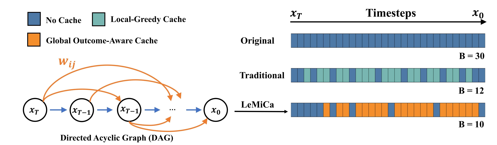
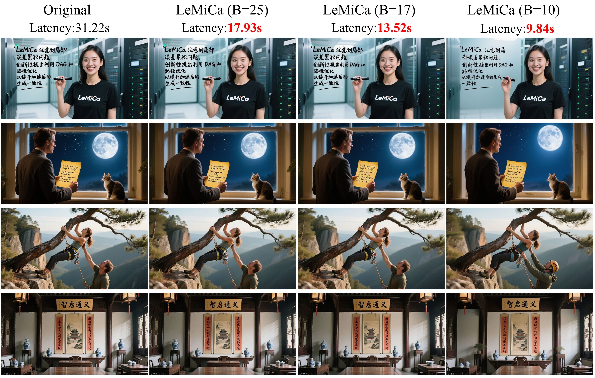

<span><a href="./README.md">📚English </a> | 📚中文阅读 &nbsp;  | &nbsp; <a href="https://mp.weixin.qq.com/s/o6MMOzbmGBRpB_a_9U8JMw?">机器之心</a> 
</span>

<div align="center">
<!-- &nbsp; -->

</div>


# [NeurIPS 2025 Spotlight] LeMiCa: Lexicographic Minimax Path Caching for Efficient Diffusion-Based Video Generation

<div class="is-size-5 publication-authors" align="center">
  <span class="author-block">
    <a href="https://github.com/joelulu" target="_blank">高焕霖</a><sup>1,2</sup><sup>*</sup>,&nbsp;
  </span>
  <span class="author-block">
    <a href="https://scholar.google.com/citations?hl=zh-CN&view_op=list_works&user=gpNOW2UAAAAJ" target="_blank">陈平</a><sup>1,2</sup><sup>*</sup>,&nbsp;
  </span>
  <span class="author-block">
    <a href="https://github.com/stone002" target="_blank">石芙源</a><sup>1,2</sup>,&nbsp;
  </span>
  <span class="author-block">
    <a href="https://github.com/tanchaow" target="_blank">谭超</a><sup>1,2</sup>,&nbsp;
  </span>
  <span class="author-block">
    <a href="https://scholar.google.com/citations?hl=en&user=L4OXOs0AAAAJ" target="_blank">刘兆祥</a><sup>1,2</sup>
  </span>
  <br>
  <span class="author-block">
    <a href="https://github.com/FangGet" target="_blank">赵放</a><sup>1,2</sup><sup>†</sup>,&nbsp;
  </span>
  <span class="author-block">
    <a href="https://scholar.google.com/citations?user=CFUQLCAAAAAJ&hl=en" target="_blank">王恺</a><sup>1,2</sup>,&nbsp;
  </span>
  <span class="author-block">
    <a href="https://scholar.google.com.hk/citations?user=kCC2oKwAAAAJ&hl=zh-CN&oi=ao" target="_blank">廉士国</a><sup>1,2</sup><sup>†</sup>
  </span>
</div>

<div class="is-size-5 publication-authors" align="center">
  <span class="author-block"><sup>1</sup>中国联通数据科学与人工智能研究院&nbsp;</span>
  <span class="author-block"><sup>2</sup>联通数据智能有限公司</span>
</div>

<div class="is-size-5 publication-authors" align="center">
  (* 共同一作. † 通讯作者.)
</div>

<h5 align="center">

<a href="https://unicomai.github.io/LeMiCa/" target="_blank">
  
</a>
<!-- <a href="https://github.com/UnicomAI/LeMiCa" target="_blank">
  
</a> -->
<a href="https://arxiv.org/abs/2511.00090" target="_blank">
  
</a>
<!-- <a href="https://github.com/UnicomAI/LeMiCa/raw/main/assets/LeMiCa_NeurIPS2025_appendix.pdf" target="_blank">
  
</a> -->
<a href="./LICENSE" target="_blank">
  
</a>
<a href="https://github.com/UnicomAI/LeMiCa/stargazers" target="_blank">
  
</a>

</h5>





## 简介

**LeMiCa** 是一个无需训练的扩散视频生成模型加速算法（也可扩展至图像生成）。不同于以往基于局部启发式阈值的方法，LeMiCa将缓存调度问题表述为带有误差加权边的全局路径优化问题，并引入了词典序极小极大（Lexicographic Minimax）策略，以限制最坏情况下的全局误差。该全局规划方法同时提升了推理速度和跨帧一致性。更多细节与可视化结果，请访问我们的 [项目主页](https://unicomai.github.io/LeMiCa/)。


## 🔥 最近更新
- [2026/04/16] ✨ 支持 [**ERNIE-Image**](https://github.com/UnicomAI/LeMiCa/tree/main/LeMiCa4ErnieImage) 文生图推理加速。
- [2026/01/29] 🔥 我们最新的工作"MeanCache: From Instantaneous to Average Velocity for Accelerating Flow Matching Inference" 已经被ICLR 2026接收! 代码及详情见：[**MeanCache**](https://github.com/UnicomAI/MeanCache)! MeanCache 在Flux.1、Qwen-Image和HunYuanVideo上分别实现了4.12倍、4.56倍和3.59倍加速比，同时保持了几乎无损的生成质量. 请参考我们的主页与论文获取更多细节. 
- [2025/01/20] 🔥 补充FLUX.1-dev和FLUX.2-klein的支持 [**LeMiCa4FLUX**](https://github.com/UnicomAI/LeMiCa/tree/main/LeMiCa4FLUX)
- [2025/12/15] 🔥 [**ComfyUI-LeMiCa**](https://github.com/UnicomAI/LeMiCa/tree/main/ComfyUI-LeMiCa) 已无缝集成至 [**ComfyUI**](https://github.com/comfyanonymous/ComfyUI)，欢迎体验。
- [2025/12/08] ✨ 支持 [**HunyuanVideo1.5**](https://github.com/UnicomAI/LeMiCa/tree/main/LeMiCa4HunyuanVideo1.5) 文生视频和图生视频。
- [2025/12/02] ✨ 支持 [**Z-Image**](https://github.com/UnicomAI/LeMiCa/tree/main/LeMiCa4Z-Image) 和 [**FLUX.2**](https://github.com/UnicomAI/LeMiCa/tree/main/LeMiCa4FLUX2) 推理加速
- [2025/11/14] ⭐ 我们开源了 [**Awesome-Acceleration-GenAI**](https://github.com/joelulu/Awesome-Acceleration-GenAI)，收集了最新生成加速技术，欢迎查看！
- [2025/11/13] ✨ 支持 [**Wan2.1**](https://github.com/UnicomAI/LeMiCa/tree/main/LeMiCa4Wan2.1) 推理加速
- [2025/11/07] ✨ [**Qwen-Image**](https://github.com/UnicomAI/LeMiCa/tree/main/LeMiCa4QwenImage) 推理加速已开源 !  
- [2025/10/29] 🚀 代码即将发布，敬请期待！ 
- [2025/09/18] ✨ 论文被选为**NeurIPS 2025 Spotlight**.  
- [2025/09/18] ✨ LeMiCa首次公开发布. 

##  展示


### HunyuanVideo1.5

### ComfyUI-LeMiCa
<p align="center">
  
</p>


### ERNIE-Image

| Method   | ERNIE-Image | LeMiCa-slow | LeMiCa-medium | LeMiCa-fast |
|:-------:|:-----------:|:-----------:|:-------------:|:-----------:|
| **Latency** | 32.168 s | 16.471 s | 11.432 s | 7.043 s |
| **T2I** |  |  |  |  |


### FLUX.2(klein-9B)

| Method              | Flux.2(klein-9B) | LeMiCa-slow         | LeMiCa-medium    | LeMiCa-fast | LeMiCa-ultra   |
|:-------------------:|:--------------------:|:--------------:|:--------------:|:-------------:|:-------------:|
| **Latency**   | 20.04 s                | 10.77 s          | 8.45 s          | 6.54 s         | 4.59 s          |
| **T2I** |  |  |  |  |  |

### Qwen-Image-2512

| Method   | Qwen-Image-2512 | LeMiCa-slow | LeMiCa-medium | LeMiCa-fast |
|:-------:|:-------:|:-----------:|:-------------:|:-----------:|
| **Latency** | 31.42 s  | 16.09 s      | 11.29 s        | 7.01 s      |
| **T2I** |  |  |  |  |

#### T2V 720P
https://github.com/user-attachments/assets/ebed2e0f-87f4-408e-98e3-93bd29bbc99f

####  I2V 720P
https://github.com/user-attachments/assets/d1a83d45-579f-4174-9477-ba0b9aebb322


### FlUX.2

| Method              | Flux.2 (CPU-offload) | Flux.2         | LeMiCa-slow    | LeMiCa-medium | LeMiCa-fast   |
|:-------------------:|:--------------------:|:--------------:|:--------------:|:-------------:|:-------------:|
| **Latency (sec)**   | 101.2                | 32.70          | 13.41          | 10.20         | 6.99          |
| **T2I** |  |  |  |  |  |


### Z-Image
| Method   | Z-Image | LeMiCa-slow | LeMiCa-medium | LeMiCa-fast |
|:-------:|:-------:|:-----------:|:-------------:|:-----------:|
| **Latency (sec)**   | 2.55 s  | 2.19 s      | 1.94 s        | 1.78 s      |
| **T2I** |  |  |  |  |


### Wan2.1
<details>
  <summary>Click to expand Wan2.1 example</summary>
https://github.com/user-attachments/assets/3d99b959-7253-47ec-af0a-da13a66e6d49
</details>

### Open-Sora

<details>
  <summary>Click to expand Open-Sora example</summary>

https://github.com/user-attachments/assets/ba205856-2d77-494a-aaa9-09189ba2915c
</details>


### Qwen-Image

<details>
  <summary>Click to expand Qwen-Image example</summary>

<div style="width:85%;max-width:1000px;margin:0 auto;">
  <!-- 图片：无边框，宽度与上面表头一致 -->
  
</div>

</details>

##  支持模型列表
LeMiCa 目前支持并已在以下基于扩散的模型上进行了测试：  

**文生视频**
- [Open-Sora](https://github.com/hpcaitech/Open-Sora)  
- [Latte](https://github.com/Vchitect/Latte)  
- [CogVideoX 1.5](https://github.com/THUDM/CogVideo)  
- [Wan2.1](https://github.com/Wan-Video/Wan2.1)  
- [HunyuanVideo-1.5](https://github.com/Tencent-Hunyuan/HunyuanVideo-1.5)
  
**文生图**
- [ERNIE-Image](https://github.com/PaddlePaddle/ERNIE)  
- [Qwen-Image](https://github.com/QwenLM/Qwen-Image)  
- [Z-Image](https://github.com/Tongyi-MAI/Z-Image)  
- [FLUX.2](https://github.com/black-forest-labs/flux2)  


## 🧩 待办列表
- ✅ 公开项目主页  
- ✅ 发布论文  
- ✅ 文生图的前向推理 
- ✅ 文生视频的前向推理  
- ☐ DAG建图代码 
- ☐ 通用加速框架   


## 🧩 社区贡献 & 友情链接

- **[Qwen-Image](https://github.com/QwenLM/Qwen-Image)** 和 **[CogVideo](https://github.com/THUDM/CogVideo)** 在其项目主页对 LeMiCa 进行了推荐。

- **[Cache-DiT](https://github.com/vipshop/cache-dit)** 一个统一且灵活的 DiT 推理加速框架，融合并实践了 LeMiCa 的核心洞察。欢迎尝试和探索。[详细内容](https://github.com/vipshop/cache-dit/blob/main/docs/User_Guide.md#steps-mask)

- [ComfyUI-LeMiCa](https://github.com/UnicomAI/LeMiCa/tree/main/ComfyUI-LeMiCa) 已经支持 **Z-Image** 节点. 感谢 @[scruffynerf](https://github.com/scruffynerf).

## 致谢
本仓库基于或受到以下开源项目的启发：[Diffusers](https://github.com/huggingface/diffusers)、[TeaCache](https://github.com/ali-vilab/TeaCache)和[VideoSys](https://github.com/NUS-HPC-AI-Lab/VideoSys)。我们衷心感谢这些社区的开放贡献与启发。


## 许可协议
本项目的大部分内容依据 [LICENSE](./LICENSE) 文件中的**Apache 2.0 许可协议**发布。

## 📖 引用
如果您在研究或应用中发现 **LeMiCa** 有所帮助，请考虑为我们点⭐并通过以下BibTeX条目引用：


```bibtex
@inproceedings{gao2025lemica,
  title     = {LeMiCa: Lexicographic Minimax Path Caching for Efficient Diffusion-Based Video Generation},
  author    = {Huanlin Gao and Ping Chen and Fuyuan Shi and Chao Tan and Zhaoxiang Liu and Fang Zhao and Kai Wang and Shiguo Lian},
  journal   = {Advances in Neural Information Processing Systems (NeurIPS)},
  year      = {2025},
  url       = {https://arxiv.org/abs/2511.00090}
}
```
